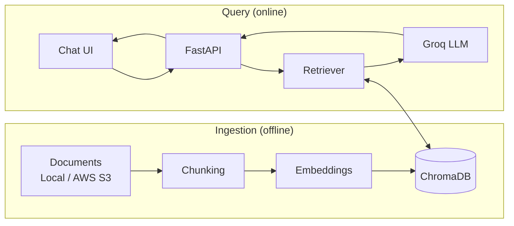

# web_chatbot_rag

**A domain-agnostic RAG chatbot that answers questions strictly from your own documents.**

Give it any knowledge base (business info, policies, product docs, personal data) and it returns accurate, source-backed answers through an embeddable web chat. Change the documents, keep the pipeline.

## Architecture



## Stack

LangChain · AWS S3 · sentence-transformers · ChromaDB · Groq · FastAPI · HTML/JS widget

## Quick Start

```bash
git clone https://github.com/<your-username>/web_chatbot_rag.git
cd web_chatbot_rag
pip install -r requirements.txt
cp .env.example .env          # add GROQ_API_KEY, set DATA_SOURCE=local|s3

python -m app.ingest          # index documents from data/ or S3
uvicorn app.main:app --reload # start the API
```

Open `frontend/index.html` to chat. To change topics, replace the documents and re-run ingestion.

## API

- `POST /chat` takes `{"message": "..."}` and returns `{"answer": "...", "sources": [...]}`
- `POST /reindex` rebuilds the index
- `GET /health` health check

## License

MIT
