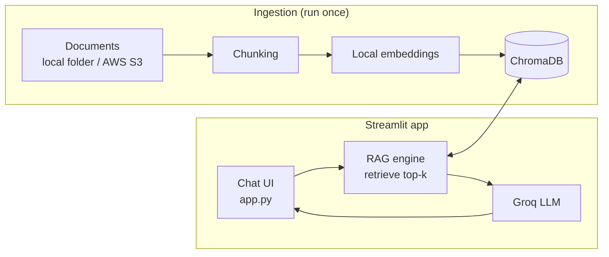

# web_chatbot_rag: Streamlit Edition

**A generic RAG chatbot with a ready-to-use Streamlit chat interface. Give it any documents and it answers questions strictly from them.**

Best for demos, internal tools, and quick prototypes. Change the documents, keep the pipeline.

## Architecture



## Quick Start

```bash
pip install -r requirements.txt
cp .env.example .env          # add GROQ_API_KEY and describe your bot
# add .md / .txt / .pdf files to data/  (or set DATA_SOURCE=s3)

python src/ingest.py          # build the index
streamlit run app.py          # open http://localhost:8501
```

## Configure (`.env`)

| Variable | Purpose |
|---|---|
| `GROQ_API_KEY` | Required |
| `BOT_NAME`, `BOT_SUBJECT`, `CONTACT` | Title, topic, and fallback contact shown in the UI and prompt |
| `WELCOME_MESSAGE` | First message in the chat |
| `DATA_SOURCE` | `local` or `s3` (with `S3_BUCKET_NAME`, `S3_PREFIX`) |

To switch topics, replace the documents and re-run `python src/ingest.py`.

