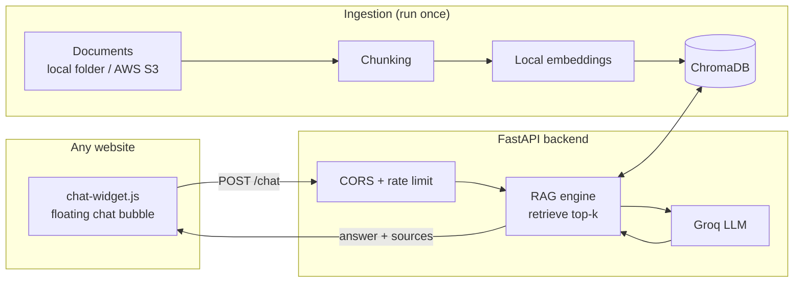

# web_chatbot_rag: FastAPI Edition

**A generic RAG chatbot served as an API with a drop-in widget, so it can be added to any website with one line of code.**

Give it any documents and it answers visitor questions strictly from them. Change the documents, keep the pipeline.

## Architecture



## Quick Start

```bash
pip install -r requirements.txt
cp .env.example .env          # add GROQ_API_KEY and describe your bot
# add .md / .txt / .pdf files to data/  (or set DATA_SOURCE=s3)

python src/ingest.py                  # build the index
uvicorn api:app --port 8000           # start the API
```

Try it: open `http://localhost:8000/static/index.html`.

## Add It to Any Website

Paste this before `</body>`:

```html
<script src="https://YOUR-API-URL/static/chat-widget.js" defer></script>
```

Optional attributes: `data-title`, `data-welcome`, `data-color="#4f46e5"`, `data-position="left"`.

## API

| Endpoint        | Description                                                            |
| --------------- | ---------------------------------------------------------------------- |
| `POST /chat`  | `{"message": "..."}` returns `{"answer": "...", "sources": [...]}` |
| `GET /config` | Bot name and greeting used by the widget                               |
| `GET /health` | Health check and chunk count                                           |

## Configure (`.env`)

| Variable                                                        | Purpose                                                                     |
| --------------------------------------------------------------- | --------------------------------------------------------------------------- |
| `GROQ_API_KEY`                                                | Required                                                                    |
| `BOT_NAME`, `BOT_SUBJECT`, `CONTACT`, `WELCOME_MESSAGE` | What the bot is about                                                       |
| `DATA_SOURCE`                                                 | `local` or `s3` (with `S3_BUCKET_NAME`, `S3_PREFIX`)                |
| `ALLOWED_ORIGINS`                                             | Sites allowed to call the API, e.g.`https://yoursite.com` (default `*`) |
| `RATE_LIMIT_PER_MIN`                                          | Requests per IP per minute (default 20)                                     |

## Deploy

```bash
docker build -t web-chatbot-rag .
docker run -p 8000:8000 --env-file .env web-chatbot-rag
```

The container indexes your documents on start, then serves the API and widget. Works on Render, Railway, AWS App Runner, or any Docker host. Use HTTPS in production, and set `ALLOWED_ORIGINS` to your site.

## Files

```
api.py            FastAPI backend
widget/           chat-widget.js + index.html
src/              config, ingest, rag_engine, s3_utils
data/             your documents
Dockerfile
```
